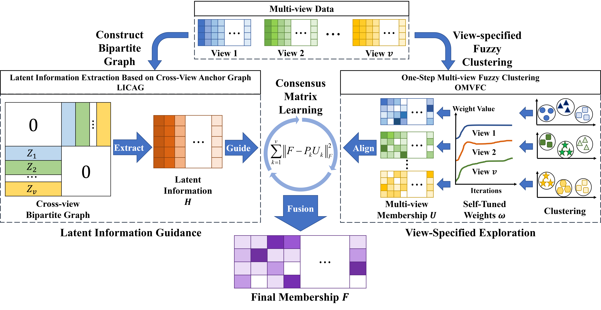

## Latent Information-Guided One-Step Multi-view Fuzzy Clustering Based on Cross-View Anchor Graph

This is the source code for the paper Latent Information-Guided One-Step Multi-view Fuzzy Clustering Based on Cross-View Anchor Graph (OMVFC-LICAG).

Fig.1 The overview of the proposed OMVFC-LICAG algorithm

Some commonly used multi-view datasets can be found in this [dataset repository](https://github.com/ChuanbinZhang/Multi-view-datasets.git)

Run "demo.m" to test the OMVFC-LICAG algorithm. The code has been tested in Matlab R2018b on a PC with Windows 10.
